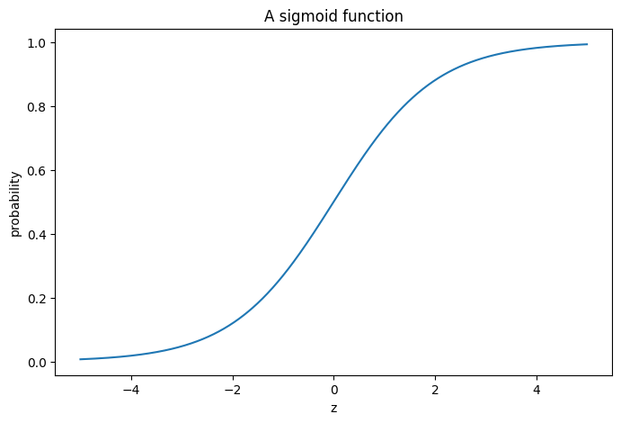
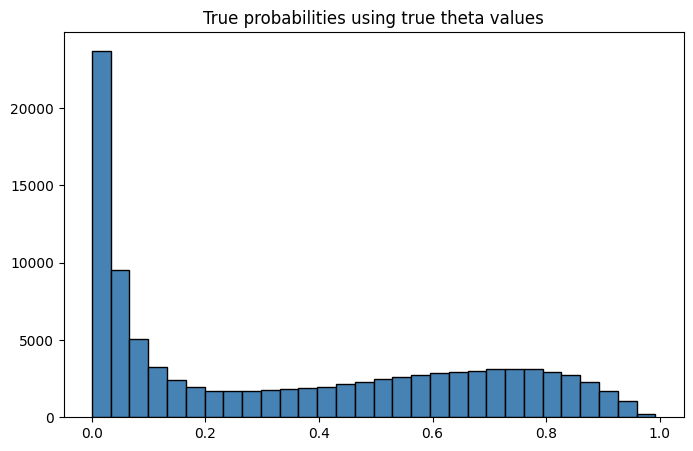
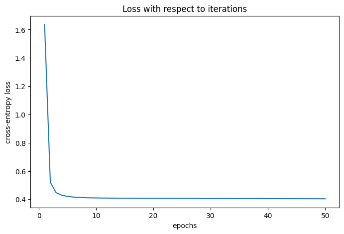
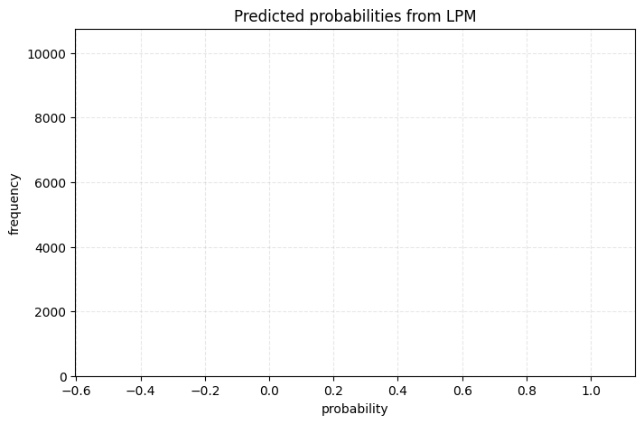
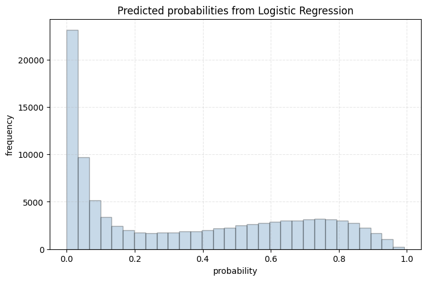

Logistic regression 

**Course:** Causal Inference

**Topic:** Logistic Regression

Say, you need to predict the probability of someone being in a good vs. bad health (binary outcome)
given a set of 
inputs: i) college education (yes or no); ii) income (high vs. low); iii) insured vs uninsured; 
and iv) stress level (continuous variable). 

For the sake of simplicity, we are going to assume a super simple DGP as follows: 

1. College education has a positive effect on health (coefficient = 0.1)
2. High income has a positive effect on health (coefficient = 0.2)
3. 40 percent more people from higher income households have college education
4. Insurance has a positive effect on health (coefficient = 0.05)
5. 60 percent more people from low income households are likely to be stressed
6. Stress has a negative effect on health (coefficient = -1)

**Note:** We know from the previous lecture that LPM estimates directly gives us the marginal
effects -- the coefficients (at least theoretically) are interpreted as the effect of marginal changes 
in $X$s on $y$. LPM estimates are straight forward and easy to interpret as most often we are 
concerned with marginal effects from a policy standpoint.
However, the coefficients pertaining to logistic regression are not marginal effects.
This will be clearer as we proceed.

We looked at the Linear Probability Model (LPM) in the previous lecture -- the estimates from a 
properly specified model were close to the true parameters. 
What if we have to estimate probability 
of someone being in good health? In this case, LPM does 
not gurantee that the probabilities are restricted between 0 and 1. 

Logistic regression is a tool that is used to model binary outcome and used for classification purposes. 
It uses a logistic function to restrict 
probabilities between values of 0 and 1. So how does it work?

Essentially, the primary goal here is to predict probabilities of a binary event. 
The true probability is written as a function of $\theta$ and $X$:
$$
p = h_\theta(X) = \sigma(\theta X)
$$

$\theta$ is a vector of true parameters -- they govern the DGP, and probabilites 
are the function of the true coefficients and inputs. 
Specifically, $\sigma(.)$ is the logistic function, defined as:

$$
\sigma(z) = \frac{1}{(1 + exp(-z))} 
$$

This $\sigma(.)$ is also known as the sigmoid function and $z=\theta X$ is often 
known as the logit. The logit is a 
linear combination of $\theta$ and $X$. By nature of the logistic function, the output is restricted
between 0 and 1.  
To see the logistic function closely, let's take a look  at the following graph.


```python

# import necessary libraries
import numpy as np    
import pandas as pd
import matplotlib.pyplot as plt

from sklearn.linear_model import LinearRegression
from sklearn.linear_model import LogisticRegression
from sklearn.preprocessing import add_dummy_feature

from pathlib import Path

# generate numbers from -5 to 5
z = np.linspace(-5, 5, 1000)
print(z[0:20])
# compute logistic values (note that these are probabilities)
sigma_z = 1/(1 + np.exp(-z))

plt.figure(figsize=(8, 5))
plt.plot(z, sigma_z)
plt.xlabel('z')
plt.title('A sigmoid function')
plt.ylabel('probability')
plt.show()
```

    [-5.         -4.98998999 -4.97997998 -4.96996997 -4.95995996 -4.94994995
     -4.93993994 -4.92992993 -4.91991992 -4.90990991 -4.8998999  -4.88988989
     -4.87987988 -4.86986987 -4.85985986 -4.84984985 -4.83983984 -4.82982983
     -4.81981982 -4.80980981]


    

    


Note that the logistic function is S-shaped -- negative logit (z) values will have 
probabilities less than 0.5, 
whereas the positive z values will have 
probablities greater than 0.5. Also, probabilities on the vertical axis are 
constrained between 0 and 1, as they should be. 
 
The inputs in the sigmoid function is: $z=\theta X$, which will help us attain probabilities. 
$X$ and $\theta$ are the features (covariates) and the 
parameters of interest, respectively.
 
Using these probability values, one can classify. For example:

$y_i = 1$ if $\hat{p_i}\geq 0.5$ or else 0.    

Our goal is to come up with the estimates of $\theta$. After we have $\hat{\theta}$, we can obtain
probabilities, perform classification based on them, or use probability estimates for downstream analysis.

**The Loss Function**

To do so, we will start with a loss function. Consider the following:

$C = -\log(\hat{p_i})$ if $y_i=1$

$C = -\log(1-\hat{p_i})$ if $y_i=0$

Generally speaking, you want the model to come up with higher probabilities for observations with 
$y_i=1$ and lower probabilities for $y_i=0$. With this in mind, consider what might happen
if $\hat{p_i}$ is small vs large (say, 0.05 vs 0.95) when $y_i=1$. 
This will inflate the loss in the former case but reduce it in the latter. The case is 
reversed for $y_i=0$; higher probabilities will yield higher loss; whereas, lower probabilities 
will yield lower loss values. So, lower 
probabilities are 'shunned' for observations with $y_i=1$, and higher probabilities are penalized 
more for observations with $y=0$. 

We put this logic together and come up with the following cross-entropy loss function:

$$
C_{\theta} = -\frac{1}{n} \sum_i^{n} [y_i \times \log(\hat{p_i}) + (1-y_i) \times \log(1-\hat{p_i})]
$$

Recall: 
$$
p = \sigma(\theta X) = \frac{1}{(1 + exp(-\theta X))}
$$ 

The *objective* is to get the estimates of $\theta$ that minimizes the loss function. Turns out that the 
loss function above don't have an analytical or a closed form solution. However, the function is convex, which
means that we can use gradient descent to estimate $\theta$. 


**Using Gradient Descent**

Let's first simulate the data following the DGP mentioned above. 
Note that the functional that's used to simulate the
outcome variable (health) will depend on probability values obtained from the 
logistic function. 


```python

# ----------------------------

# A. Simulate data 

# ----------------------------

# 1. College education has a positive effect on health (coefficient = 0.1)
# 2. High income has a positive effect on health (coefficient = 0.2)
# 3. 40 percent more people from higher income households have college education
# 4. Insurance has a positive effect on health (coefficient = 0.05)
# 5. Stress has a negative effect on health (coefficient = -1)

# number of obs
n = 100000

# 1. income 
income_log = np.random.lognormal(0, 1, n)
income = income_log * 20000
ln_income = np.log(income)
# categorize high vs low income based on median income
high_income = (income>=np.median(income)).astype('int')
low_income = (income<np.median(income)).astype('int')

# 2. college 
def gen_college(prob):
    col = np.random.binomial(1, prob, 1)
    return col

college = []
for i in range(n):
    # 40% more people from high income group will have college degree
    college_i = gen_college(0.2 + 0.4*high_income[i])
    college.append(college_i)

college = np.array(college).ravel()
print(f"mean of college: {college.mean()}")

print(f"share college for high income: {np.mean(college[high_income == 1])}")
print(f"share college for low income: {np.mean(college[high_income == 0])}")

# 3. Stress 
def gen_stress(prob):
    p = np.random.binomial(1, prob, 1)
    return p

stress = []

for i in range(n):
    # 60% more people in low income will be stressed
    stress_i = gen_stress(0.6*low_income[i])
    stress.append(stress_i)

# a continuous stress variable dependent on income status
stress = np.array(stress).ravel() + np.random.normal(3, 1, n)*low_income + np.random.normal(0, 1, n)

# histogram of the stress index
plt.figure(figsize=(8, 5))
plt.hist(stress, bins=30, color="steelblue", edgecolor="black", alpha=0.3)
plt.xlabel('stress index')
plt.ylabel('frequency')
plt.title('Histogram of stress index')
plt.show()

print(f"average stress index for low income group: {stress[high_income==0].mean().round(4)}")
print(f"average stress index for high income group: {stress[high_income==1].mean().round(4)}")

# 4. Insurance (exogeneous -- does not depend on other Xs)
insurance = np.random.binomial(1, 0.3, n)
print(f"fraction insured: {insurance.mean()}")

# 5. health (Y variable)
def gen_health(prob):
    h = np.random.binomial(1, prob, 1) # these probabilities are going to come from the logistic function
    return h

# ----------------------------------------------------


# Logistic regression using the gradient descent 


# ----------------------------------------------------
# define the logistic function
def sigma(input):
    logistic = 1/(1 + np.exp(-input)) 
    return logistic

# true thetas governing the DGP
theta_true = np.array([0.3, 0.1, 0.2, 0.05, -1])
sigma(theta_true)
X = np.concatenate((college.reshape((n, 1)), 
                    high_income.reshape((n, 1)), 
                    insurance.reshape((n, 1)), 
                    stress.reshape((n, 1))),
                    axis=1)
X = add_dummy_feature(X) # this adds 1 in the first column (intercept)
z = X @ theta_true.reshape((5, 1))
prob_logit = sigma(z)  # output true probabilities

# NOTE: PROBABILITIES COME FROM THE LOGISTIC FUNCTION. THIS IS THE KEY TO SIMULATE LOGISTIC REGRESSION.
# Step 1: Calculate linear combination (logit): z = X @ theta
# Step 2: Transform to probabilities: p = sigma(z) = 1/(1 + exp(-z))
# Step 3: Generate binary outcomes using these probabilities using a binomial dist.

plt.figure(figsize=(8, 5))
plt.hist(prob_logit, bins=30, color="steelblue", edgecolor="black")
plt.grid(True, alpha=0, linestyle='--')
plt.title('True probabilities using true theta values')
plt.show()

# generate health using probabilities
health = []
for i in range(n):
    health_i = gen_health(prob_logit[i]) # AGAIN, THESE PROBABILITIES COME FROM THE LOGISTIC FUNCTION
    health.append(health_i)

health = np.array(health).ravel()
```

    mean of college: 0.40291

    
    share college for high income: 0.603
    share college for low income: 0.20282


    

    


    average stress index for low income group: 3.6107
    average stress index for high income group: 0.0004
    fraction insured: 0.30029


    

    


Since, this is a simulation, we know the true probabilities generated using the 
true coefficients and the DGP. From a practitioner's standpoint, we won't know the 
true probabilities in non-experimental settings, since we don't know the true DGP to begin with. We have to estimate 
them.
Let's print out our some summary measures on health.


```python
#print(f"y variable: {health} \n")
#print(f"X matrix: {X}")
print(f"fraction with good health: {health.mean()}")

# create a stress band around the mean for no college, low income and uninsured
mean_stress_baseline = stress[(college==0) & (high_income==0) & (insurance==0)].mean()
stress_tolerance = 0.5  # within ±0.5 of mean
stress_band = (np.abs(stress - mean_stress_baseline) <= stress_tolerance)

print(f"fraction with good health among no school, low income, and uninsured: {np.mean(health[(college==0) & 
                                                                                               (high_income==0) & 
                                                                                               (insurance==0) & 
                                                                                               (stress_band)]).round(4)}")
```

    fraction with good health: 0.34948
    fraction with good health among no school, low income, and uninsured: 0.0353


The true $\theta$ values are $[\theta_0=0.3, \theta_1=0.1, 
\theta_2=0.2, \theta_3=0.05, \theta_4=-1]$. 

a. 0.3 is the intercept coefficient, representing people in no college, 
low income, and uninsured group.

b. 0.1 corresponds to college coefficient.

c. 0.2 corresponds to high income coefficient.

d. 0.05 corresponds to insurance coefficient.

e. -1 corresponds to stress coefficient.
 
Note that 3.61 percent of people who have no schooling, are of low income, are uninsured and around the mean stress 
index are in good health. This pertains to true $\theta$ of 0.3. Let's convert this value 
into probability using:


```python
p_gh = 1/(1 + np.exp(-0.3 + np.mean(stress[(college==0) & (high_income==0) & (insurance==0)])))
print(f"the conversion of theta = 0.3 + mean stress value to prob: {p_gh.round(4)} \n")
```

    the conversion of theta = 0.3 + mean stress value to prob: 0.035 
    


Notice that according to the DGP, around 3.55 percent of people in the population with no college,
low income, uninsured, and of the mean stress value are in good health. 
This is close to what we have in our sample. Hence,
it is important to recognize that $\theta$ values are coefficients and in the case of logistic 
regression; they are different from probabilities.

**Gradient Descent**

Let's move on to the gradient descent and its usage in estimating $\theta$.

Simply put, gradient is a vector of the partial derivatives of the loss function with respect to each 
$\theta$ stacked together.

$$
\text{gradient} = \begin{bmatrix} \frac{\partial C}{\partial \theta_0} \\ \frac{\partial C}{\partial \theta_1} \\ \frac{\partial C}{\partial \theta_2} \\ \frac{\partial C}{\partial \theta_3} \end{bmatrix}
$$ 

Before we get to the gradient of the logistic kind, let's stack the loss function using matrices:

$$C_{\theta} = -\frac{1}{n} [Y^{t} \log(p) + (1-Y^{t}) \log(1- p)]$$

Replacing $p= \sigma(\theta X)$, we have:  

$$C_{\theta} = -\frac{1}{n} [Y^{t} \log(\sigma(X\theta)) + (1-Y^{t}) \log(1-\sigma(X\theta)]$$

$C$ will be a scalar.
Next, get $\frac{\partial C}{\partial \theta}$.

But first, here are the dimensions of terms in the RHS:

a. $X: (n\times 5)$

b. $Y^{T}: (1\times n)$

c. $\theta : (5\times 1)$

d. $X\theta : (n\times 1)$

e. $Y^{t} \log(\sigma(X\theta)): scalar$

Taking the partial derivative of the newly formatted cost function $C$ with 
respect to $\theta$, you get the gradient vector
as follows:

$\frac{\partial C}{\partial \theta} = \frac{1}{n} X^{T}(\sigma(X \theta) - Y)$. 

where, $X^{T}$ is a $5\times n$ matrix and $(X^{T}\sigma(X \theta) - Y)$ is a $n \times 1$ matrix. 
I solved for the partial using 
the brute force chain rule. One thing to note while solving is a small trick below:

$\frac{exp(\theta X)}{1 + exp(\theta X)} =  \frac{1 + exp(\theta X) -1}{1 + exp(\theta X)}$. This results to:
$1 - \frac{1}{1 + exp(\theta X)} = 1 - \sigma(\theta X)$. 

This is getting into minute little details. You can escape this 
and just take the word for the gradient or you could try it all out. Upto you! 

Now that we are through with all this, the gradient descent algorithm is straight forward.

**Gradient Descent Algorithm**

1. Initialize the $\theta_{gd}$ values. I've used values from the normal distribution. 

2. Initialize the learning rate -- $\eta$ and the number of interations (epochs). We set $\eta = 0.5$ and epochs=50.

3. Compute the gradient. Call this $gd_i$.    

4. Adjust $\theta$ using the gradient and the learning rate as: $\theta_{gd} = \theta_{gd} - \eta \times gd_i$. Note that 
we have to move against the gradient; hence, the negative.

5. Iterate steps 3 and 4 for $iter=epochs$ number of times or until the algorithm converges.


```python
# Gradient Descent 
theta_gd = np.random.normal(0, 1, 5)    # initial theta values from the normal dist.
epsilon = 1e-15                         # to prevent overflow coming from logit values close to 0.
epochs = 50                           # number of iterations
eta = 0.5                               # learning rate
loss = []

for i in range(epochs):

    z = np.clip(X @ theta_gd.reshape((5, 1)), -500, 500)
    gradient_i = ((sigma(z) - health.reshape((n, 1))).transpose() @ X) / n # caculate the gradient
    theta_gd = theta_gd - eta*gradient_i                                   # adjust theta by moving opposite to the gradient
    loss_i = np.mean(health*(-np.log(sigma(z)+epsilon).ravel()) +          # calculate loss
                    (1-health)*(-np.log(1-sigma(z)+epsilon).ravel()))
    loss.append(loss_i)                                                     # append loss

print(f"theta estimates from gradient descent: {theta_gd.round(4)} \n \n")

plt.figure(figsize=(8, 5))
plt.plot(np.linspace(1, epochs, epochs), np.array(loss).ravel())
plt.xlabel('epochs')
plt.ylabel('cross-entropy loss')
plt.title("Loss with respect to iterations")
plt.show()
```

    theta estimates from gradient descent: [[-0.296  -0.2989  1.1594 -0.1458 -0.8166]] 
     
    


    

    


We've now estimated the $\theta$ using gradient descent. Let's verify our results using the 
in-built library in sklearn that estimates the Logistic Regression.


```python
# compare estimates from sklearn
mod = LogisticRegression(max_iter=epochs, fit_intercept=False, C=np.inf)
mod_fit = mod.fit(X, health)
print(f"Estimates from sklearn: {mod_fit.coef_}")

results = {
            "GD": theta_gd.ravel().round(3),
            "SK": mod_fit.coef_.ravel().round(3)
}

pd.DataFrame(results)
```

    Estimates from sklearn: [[ 0.32179444  0.08030071  0.20651284  0.01809187 -0.99105091]]


    /home/vinish/Dropbox/Machine Learning/myenv/lib/python3.12/site-packages/sklearn/linear_model/_logistic.py:1170: UserWarning: Setting penalty=None will ignore the C and l1_ratio parameters
      warnings.warn(


<div>
<style scoped>
    .dataframe tbody tr th:only-of-type {
        vertical-align: middle;
    }

    .dataframe tbody tr th {
        vertical-align: top;
    }

    .dataframe thead th {
        text-align: right;
    }
</style>
<table border="1" class="dataframe">
  <thead>
    <tr style="text-align: right;">
      <th></th>
      <th>GD</th>
      <th>SK</th>
    </tr>
  </thead>
  <tbody>
    <tr>
      <th>0</th>
      <td>-0.296</td>
      <td>0.322</td>
    </tr>
    <tr>
      <th>1</th>
      <td>-0.299</td>
      <td>0.080</td>
    </tr>
    <tr>
      <th>2</th>
      <td>1.159</td>
      <td>0.207</td>
    </tr>
    <tr>
      <th>3</th>
      <td>-0.146</td>
      <td>0.018</td>
    </tr>
    <tr>
      <th>4</th>
      <td>-0.817</td>
      <td>-0.991</td>
    </tr>
  </tbody>
</table>
</div>


Let's estimate the model using the LPM -- note that this is a wrong functional form at use. 


```python
# linear regression
mod_linear = LinearRegression(fit_intercept=False) # we dont want to double fit the intercept; X already contains it 
mod_linear = mod_linear.fit(X, health)
print(f"Estimates from linear reg: {mod_linear.coef_}")
```

    Estimates from linear reg: [ 0.44695463  0.01138116  0.16453216  0.0015579  -0.10234894]


The estimates from the gradient descent and sklearn are virtually similar. Note that the interpretation of $\theta$ estimates 
are not equivalent to marginal effects as they are in the LPM set up. Recall, in the case of logistic regression: 
$\hat{p} = \frac{1}{(1 + exp(-\theta X))}$. Hence, we need to translate $\theta$ into marginal effects 
before comparing them with LPM's estimates. Calculation of marginal effect needs to be with respect to a given benchmark.
There is nothing wrong with creating a benchmark.
Say, we consider person A: with no college, low income, uninsured, and stress level around the mean (for the group with 
no college, uninsured, and low income) as this benchmark person and the marginal effects 
are computed with respect to this person. 
 
The following code translates $\theta$ into marginal effect.


```python
def fun_me(theta_vals, person):
    logit = (theta_vals @ person).ravel()
    p = sigma(logit)
    return p

# create person A: without college, low income, and uninsured   
# NOTE: This will be our benchmark person.
person_A = np.array([1, 0, 0, 0, mean_stress_baseline]).reshape((5, 1))
prob_health_A = fun_me(theta_gd, person_A)
print(f"The probability that person A is in good health is:{prob_health_A} \n")

# Person B: with college but low income and uninsured
person_B = np.array([1, 1, 0, 0, mean_stress_baseline]).reshape((5, 1))
prob_health_B = fun_me(theta_gd, person_B)
print(f"The probability that person B is in good health is: {prob_health_B} \n")

# Person C: with high income but without college and uninsured
person_C = np.array([1, 0, 1, 0, mean_stress_baseline]).reshape((5, 1))
prob_health_C = fun_me(theta_gd, person_C)
print(prob_health_C)

# Person D: with insurance but without college and low income
person_D = np.array([1, 0, 0, 1, mean_stress_baseline]).reshape((5, 1))
prob_health_D = fun_me(theta_gd, person_D)
print(prob_health_D)

# Person E: Same as Person A but one unit increase in stress for marginal effects
person_E = np.array([1, 0, 0, 0, mean_stress_baseline + 1]).reshape((5, 1))
prob_health_E = fun_me(theta_gd, person_E)
print(prob_health_E)
```

    The probability that person A is in good health is:[0.03732477] 
    
    The probability that person B is in good health is: [0.02795158] 
    
    [0.11001232]
    [0.0324238]
    [0.01684625]


Since we are using Person A as the benchmark, we can compute marginal probabilities simply by 
substracting probabilities.


```python
me_B_A = prob_health_B - prob_health_A 
me_C_A = prob_health_C - prob_health_A 
me_D_A = prob_health_D - prob_health_A
me_E_A = prob_health_E - prob_health_A

me = np.array([prob_health_A, me_B_A, me_C_A, me_D_A, me_E_A])

results_me_lpm = {
                    "ME:logistic": me.ravel().round(3),
                    "ME:LPM": mod_linear.coef_.ravel().round(3)
}

pd.DataFrame(results_me_lpm)
```


<div>
<style scoped>
    .dataframe tbody tr th:only-of-type {
        vertical-align: middle;
    }

    .dataframe tbody tr th {
        vertical-align: top;
    }

    .dataframe thead th {
        text-align: right;
    }
</style>
<table border="1" class="dataframe">
  <thead>
    <tr style="text-align: right;">
      <th></th>
      <th>ME:logistic</th>
      <th>ME:LPM</th>
    </tr>
  </thead>
  <tbody>
    <tr>
      <th>0</th>
      <td>0.037</td>
      <td>0.447</td>
    </tr>
    <tr>
      <th>1</th>
      <td>-0.009</td>
      <td>0.011</td>
    </tr>
    <tr>
      <th>2</th>
      <td>0.073</td>
      <td>0.165</td>
    </tr>
    <tr>
      <th>3</th>
      <td>-0.005</td>
      <td>0.002</td>
    </tr>
    <tr>
      <th>4</th>
      <td>-0.020</td>
      <td>-0.102</td>
    </tr>
  </tbody>
</table>
</div>


The marginal effects from LPM and logistic regression are shown in the table. 
Let's take a look at predicted probabilities from both LPM and logistic regression models:


```python
# prediction from LPM
prob_linear = mod_linear.predict(X) # LPM directly gives probabilites
print(prob_linear) 

plt.figure(figsize=(8, 5))
plt.hist(prob_linear, bins = 30, color="red", edgecolor="black", alpha=0)
plt.xlabel('probability')
plt.ylabel('frequency')
plt.title('Predicted probabilities from LPM')
plt.grid(True, alpha=0.3, linestyle="--")
plt.show()

# predictions from logistic
prob_logit_predict = mod_fit.predict_proba(X) # need to call .predict_proba() to get probabilities from logistic model

plt.figure(figsize=(8,5))
plt.hist(prob_logit_predict[:,1], bins=30, color="steelblue", edgecolor="black", alpha=0.3)
#plt.hist(prob_logit, bins=30, color="red", edgecolor="black", alpha=0.3)
plt.xlabel('probability')
plt.ylabel('frequency')
plt.grid(True, alpha=0.3, linestyle='--')
plt.title('Predicted probabilities from Logistic Regression')
plt.show()
```

    [ 0.29927004  0.64684742  0.74602907 ... -0.02085397  0.80991622
      0.74443065]


    

    


    

    


We see that the predicted probabilities from LPM are negative (this can't happen), whereas those from the logistic 
model closely mimic the actual probabilities. Hence, if the goal is to attain probabilities then logistic regression 
is clearly better than LPM.


**LPM vs Logistic Regression**

From a practitioner's perspective, one can get by using LPM if the goal is to infer causality alone and you 
aren't concerned about predicting probabilities. It is simple, easy to interpret, and will require low computational power. 
It does mean that you should, but you can get by. However, if the goal is to predict, say probability of the binary outcome, 
then LPM is a no-go. 

In the world of causality, the importance of estimating the probability of someone being treated (vs untreated) cannot be overstated. 
We know this as propensity scores. Logistic regression can be a good starting model while estimating propensity scores.  
