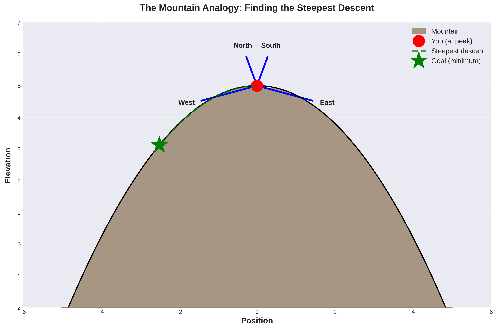
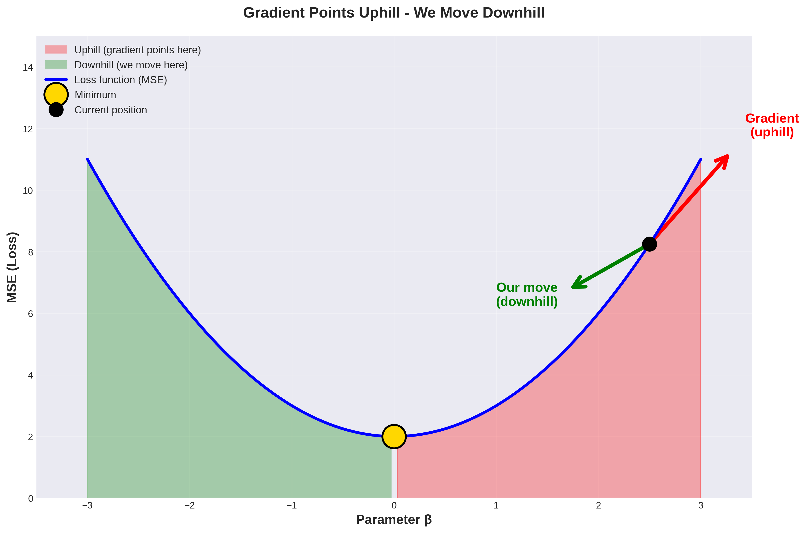
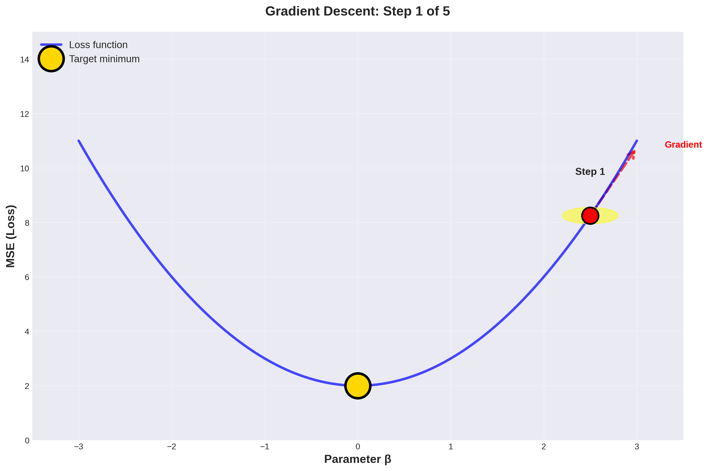
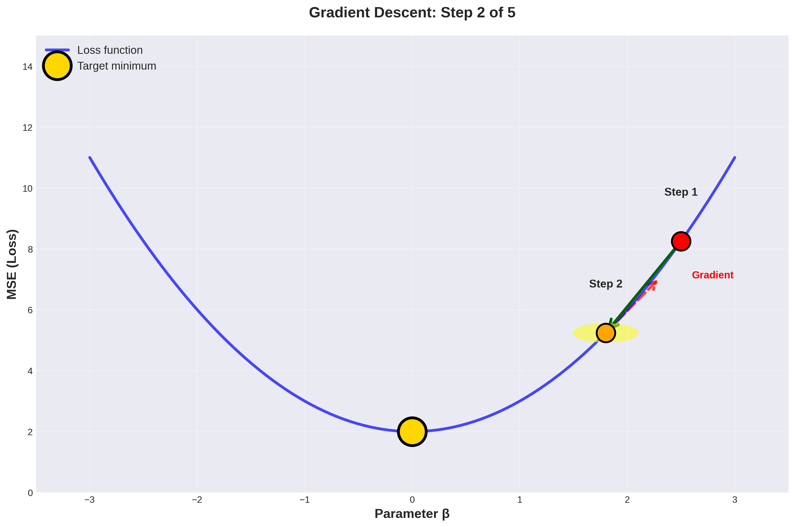
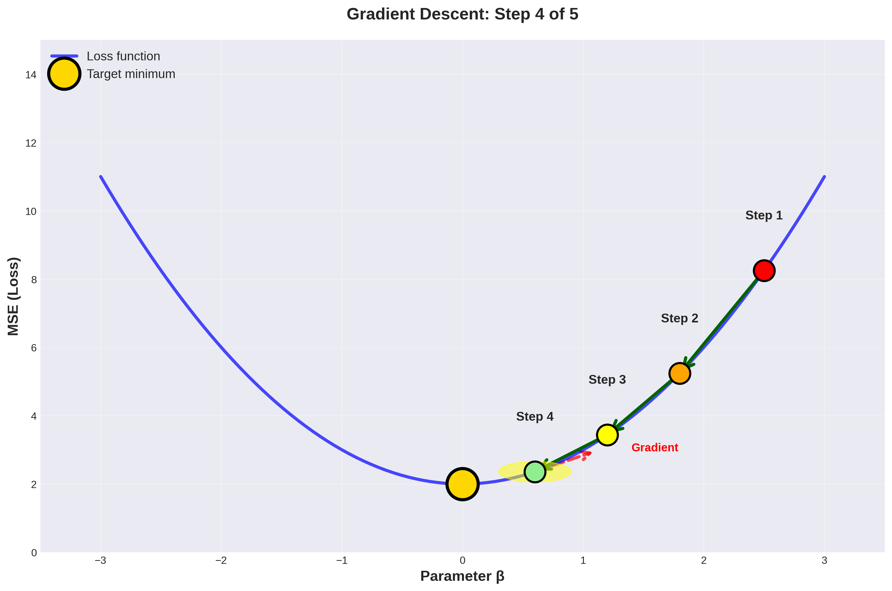
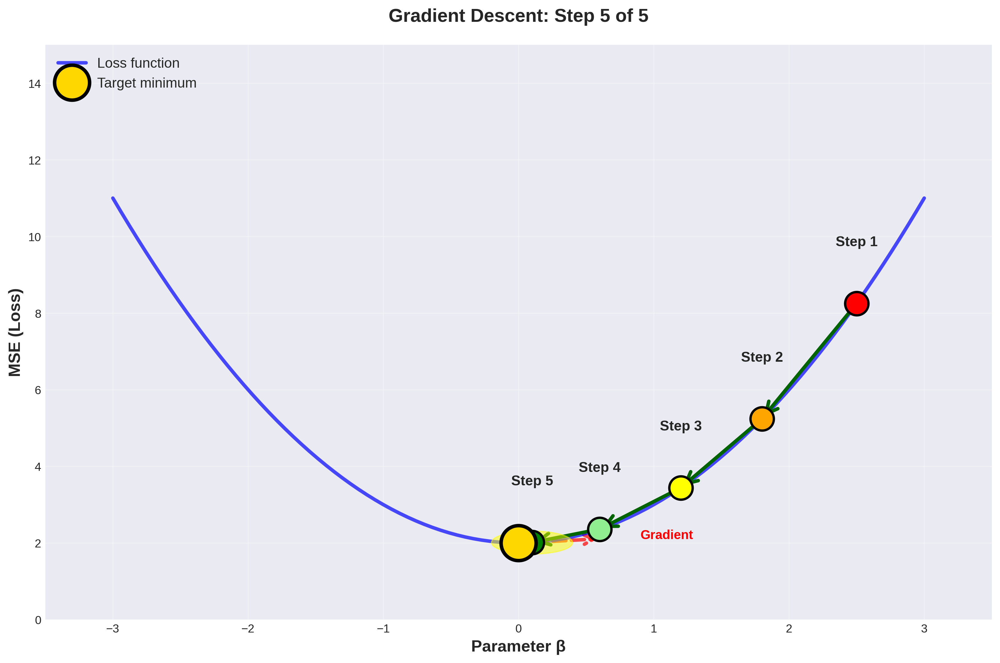

# Motivation

```{r setup, include=FALSE}
knitr::opts_chunk$set(warning = FALSE, echo = FALSE, message = FALSE, 
fig.width = 5, fig.height = 3)

# declare paths and libraries
user <- 1
if (user == 1) {
  source("/home/vinish/Dropbox/Medicaid_South/code/filepath.r")
}else {
  source("/Users/vshrestha/Dropbox/Medicaid_South/code/filepath.r")
}


library(pacman)
p_load(fixest, dplyr, ggplot2, tidyverse, patchwork, arrow, stargazer, broom, knitr)
theme_set(theme_minimal())

set.seed(125789)
```

## Motivation 

- Discussion of *good* vs. *bad* pathways 

- Close down the *bad* pathways as much as possible 

- **User regression as a tool for causal inference** 

- Other usage: prediction $E(Y|X)$

## Motivation 

- Ran several regression models towards the end of last lecture 

- We were happy that once accounting for income, we were able to trace the effect of 
college education on health 

- By *controlling* for ``necessary variables"
    - causal effects 

# The best-fit or regression line 

## Say we want to understand the relationship between education and income 
- simulate the data 

```{r, echo = TRUE}
n  <- 1000
educ  <- sample(seq(1, 16, 1), n, replace = TRUE)
income  <- 20000 + 2000 * educ + rnorm(n, mean = 10000, sd = 5000)
dat  <- data.frame(educ = educ, income = income)

# mean income for each value of education
dat_sum  <- dat  %>% 
                group_by(educ)  %>% 
                summarize(mean_income = mean(income))
# merge 
dat  <- dat  %>% 
            merge(dat_sum, by = "educ", all.x = T)
```


## Plot conditional means and regression line 
```{r}
f0  <- ggplot(dat, aes(x = educ, y = income)) + geom_point() + 
            geom_line(aes(x = educ, y = mean_income), size = 1) +
        xlab("years of education") + ggtitle("Panel A") + 
        annotate("text", x = 10, y = 35000, 
                label = "Line plotting the conditional mean", color = "blue", hjust = 0)

f1  <- ggplot(dat, aes(x = educ, y = income)) + geom_point() + 
geom_smooth(method = "lm", se = FALSE, color  = "blue") + xlab("years of education") + 
annotate("text", x = 10, y = 35000, label = "Best-Fit Line; E(Y|X)", color = "blue", hjust = 0) + 
ggtitle("Panel B")

f0 / f1
```

# Linear regression specification 

## A simple regression specification 

- the relationship between years of education and earnings using a linear simple (univariate) regression model.

\begin{equation}
Y_{i} = \alpha + \beta X_{i} + \epsilon_{i}  
\end{equation}

where, 

- $Y_{i}$ is income for an individual $i$, 

- $X_i$ is years of education, 

- $\alpha$ is the y-intercept, *(population parameter)*

- $\beta$ is the slope, *(population parameter)*

- $\epsilon_i$ is the error term. $\epsilon_i = Y_i - \alpha - \beta X_i$.

## A simple regression specification 

- population concept 

- If you'd have everyone in the population in the data set, $\beta$ is the population coefficient

- $\epsilon$ or the error is also a population concept 

- You (almost always) you don't observe the population; you have to work with the sample 

- Using a sample, you need to estimate $\alpha$ and $\beta$

## Simple to multiple regression 

- Move to multiple regression 

\begin{equation}
Y_{i} = \alpha + \beta_1 X_{1i} + \beta_2 X_{2i} + \epsilon_{i}  (\#eq:reg1)
\end{equation}

- $X_1$ is years of schooling 

- $X_2$ is years of experience 

*You've added $X2$ linearly in the model. You can add other variables similarly. That's where it gets its name -- linear regression.*

- To aim for simplicity, we'll mainly focus on simple linear regression.

# Error Term 

## Error 

- For the regression to make sense, we've got to make some assumptions regarding the error term

- Anything that explains $Y$ but is not specified in the regression is captured by the error term

- In the real-world earning equation, miss out on:
    - experience
    - earnings increases with experience 

- If not specified, this variable is observed by the error term


## Stochastic model versus deterministic 

- Error term makes the regression model stochastic 
    - introduces uncertaintly in the model 

- Says, there are other factors (including noise) not included in the model that explains the variation in $Y$ 

- Say, if you build an eagle-eye model
    - include all of the variables that should be in the model
    - have the functional form correctly specified

- Error term drops out and the model becomes deterministic 
    - e.g., $y = mx + c$


## Assumption on the error term for OLS

1. $\epsilon \underbrace{\sim}_{i.i.d} N(0, \; \sigma^2)$
    - This assumption states that the error term is independent and identically distributed
    - Comes from the normal distribution with 0 mean and variance of $\sigma^2$ 
    - assumes homoskedasticity

**A strong assumption** -- error terms might be correlated 

- Individuals who live close each other in terms of spatial proximity might share something in common

- Variance in the error term might vary with values on $X$s
    - variance in earnings might be higher for those with high level of education 
    - heteroskedasticity (violates OLS assumption)


## Assumption on the error term for OLS

2. Exogeneity assumption

```{r, fig.width = 5, fig.height = 2.5}
library(dagitty) # libraries for DAG
library(ggdag)

# Define a causal diagram
dag <- dagitty("
dag {
  health -> educa     
  educa -> earn     
  health -> earn     
  race -> educa
  race -> earn
  height -> earn     
}
")

# Visualize the DAG
ggdag(dag) +
  theme_minimal() +
  theme_void()
```


## Exogeneity Assumption 

- You'd want to close the backdoor 
    - control for health and race 

- height is exogeneous 
    - is not correlated to the explanatory variables ($X$s) that explain $Y$ 

- The exogeneity assumption states that the error term $(\epsilon)$ is uncorrelated with the explanatory variables Xs included in the model.
    - means that after accounting for Xs, the error term is independent of $X$s

\begin{equation}
E(\epsilon|X) = 0 
\end{equation}

## Let's re-write the two assumptions 

1. $\epsilon \underbrace{\sim}_{i.i.d} N(0, \; \sigma^2)$

2. $E(\epsilon|X) = 0$ 

From 2. we get: 

\begin{align}
E(\epsilon X) = E[E[\epsilon X|X]] = E[X\underbrace{E[\epsilon |X]}_{=0}] \\
       = 0
\end{align}

- The first and second equality comes from the law of iterated expectation


# Analytical Solution 

## Solve 
So we've got two population-related assumptions:

i) $E(\epsilon) = 0$ 

ii) $E(\epsilon X) = 0$

Note that there are two unknowns ($\alpha$ and $\beta$). Let's first 
set-up the sample counterparts: 

a. $\frac{1}{n} \sum_{i}^{n}(Y_i - \hat{\alpha} - \hat{\beta} X_i) = 0$

b. $\frac{1}{n} \sum_{i}^{n} X_i(Y_i - \hat{\alpha} - \hat{\beta} X_i) = 0$


## Solve $\hat{\alpha}$

\begin{align}
\frac{1}{n} \sum_{i}^{n}(Y_i - \hat{\alpha} - \hat{\beta} X_i) = 0 \\
\hat{\alpha} = \hat{Y} - \hat{\beta} \hat{X}
\end{align}

## Replace, the value of $\hat{\alpha}$ into the second equation to get:

\begin{align}
\frac{1}{n} \sum_{i}^{n} X_i(Y_i - \hat{\alpha} - \hat{\beta} X_i) = 0 \\
\frac{1}{n} \sum_{i}^{n} X_i(Y_i - \hat{Y} + \hat{\beta} \hat{X} - \hat{\beta} X_i) = 0 \\
\frac{1}{n} \sum_{i}^{n} X_i(Y_i - \hat{Y}) = \hat{\beta} \frac{1}{n} \sum_{i}^{n}X_i (X_i - \hat{X}) \\
\frac{1}{n} \sum_{i}^{n} (Y_i - \hat{Y}) = \hat{\beta} \frac{1}{n} \sum_{i}^{n} (X_i - \hat{X}) \\
\frac{1}{n} \sum_{i}^{n} (Y_i - \hat{Y})(X_i - \hat{X}) = \hat{\beta} \frac{1}{n} \sum_{i}^{n} (X_i - \hat{X})^2 \\
\hat{\beta} = \frac{cov(X,Y)}{var(X)}
\end{align}

# Decomposition 

## Explained and unexplained components 

- The linear regression is estimating the conditional mean. The conditional mean function is written as:

\begin{equation}
E(Y_i|X_i)= \alpha + \beta Xi
\end{equation}

- The above equality directly comes from the underlying assumption $E(\epsilon|X)=0$

- Re-write the regression specification as: 

\begin{equation}
Y_i = \underbrace{E(Y_i | X_i)}_{conditional \; expectation} + \underbrace{\epsilon_i}_{unobserved \; component} 
\end{equation}

- $E(Y_i | X_i)$ used for prediction purposes

# Estimation 

## Different ways to estimate the regression parameters 

1. Method of moments 
    - seen this in previous slides 

2. Maximum likelihood estimation 

3. Minimizing the sum of the square of residuals

4. Gradient Descent

- Let's discuss 3.

## Objective 

- Intuitively, we'd want to minimize the prediction error

- Objective function (minimize sum of the square of residuals)

\begin{equation}
\underbrace{min}_{\alpha, \; \beta} \sum_{i = 1}^N \bigg(Y_{i} - (\alpha + \beta X_{i})\bigg)^2 
\end{equation}

- The estimates of $\alpha$ and $\beta$ are termed as $\widehat{\alpha}$ and $\widehat{\beta}$

## Algorithm

1. Create a grid form for $\alpha$ and $\beta$ values.

```{r, echo = TRUE}
alpha_vals  <- seq(18000, 35000, by = 10) 
beta_vals  <-  seq(500, 5000, by = 10)

# create a grid 
grid  <- expand.grid(alpha_vals = alpha_vals, beta_vals = beta_vals)

store  <- rep(0, nrow(grid))
```

## Algorithm 

2. Declare the objective function. The function takes in the values of $X$, $Y$, $\tilde{\alpha}$, 
$\tilde{\beta}$ and gives the ssr.

```{r, echo = TRUE}
fun_objective  <- function(alpha, beta, X, Y) {

    # @Arg alpha: intercept
    # @Arg beta: slope
    # @Arg X: independent variable 
    # @Arg Y: dependent variable 

    residual_sq  <-  (Y - alpha - beta * X)^2
    ssr  <- sum(residual_sq)

    return(ssr)   

}

```

## Algorithm 
3. Pick the estimates on $\alpha$ and $\beta$ that minimizes the ssr. 

```{r, echo = TRUE}
for(i in seq(nrow(grid))){
store[i]  <- fun_objective(alpha = grid[i,1], beta = grid[i,2], 
                            X = educ, Y = income)
}

index  <- which(store == min(store))
coef  <- grid[index, ]
```

## Algorithm 
4. Compare the estimate that minimizes the ssr with estimates produced from in-built regression 
library in R. 

```{r, echo = TRUE, message = FALSE}
print(grid[index, ])

print(coef(lm(income ~ educ, dat)))
```

## Algorithm 
5. Let's plot to see how ssr varies with estimates of $\beta$. Fix the value of $\alpha$ at the estimate 
from 4. 

```{r, echo = TRUE}
# create a dataframe
data  <- cbind(grid, store)

# restrict the value of alpha at the one that minimizes the ssr
data  <- data  %>% 
            filter(alpha_vals == coef[[1]])

# get the estimate on beta for the set alpha so that it minimizes ssr  
beta_hat  <- beta_vals[which(data$store == min(data$store))]
```

## Plot of SSR with estimates of $\beta$

```{r, echo = TRUE}
#plot
f  <- ggplot(data, aes(x = beta_vals, y = store)) + geom_point() + 
geom_vline(xintercept = beta_hat) + 
ylab("residual sum of \n square") + xlab("beta values")
```

## Plot of SSR with estimates of $\beta$

```{r}
f
```

# Gradient Descent 

## Slide 1: The Mountain Analogy
:::::: {.columns}
::: {.column}
**You're at the top of a mountain** - want to get down fast

- **Strategy**: Look around in all directions
- **Action**: Take a small step in the steepest downward direction
- **Repeat**: Pause, reassess, step again
- **Result**: Fastest descent to the bottom
:::

::: {.column}

:::
::::::


## Slide 2: From Mountains to Math


:::::: {.columns}
::: {.column}

**MSE is our "mountain"** - we want to reach the bottom (minimum)

**Two approaches**:

- Normal equation: Direct calculation (helicopter)
- Gradient descent: Step-by-step descent (hiking)

**The gradient**: Points to steepest *upward* direction

**Our move**: Go the *opposite* way to descend
:::

::: {.column}

:::
::::::

---

## Slide 3: What is a Gradient?

- **Definition**: Vector of partial derivatives

- **What it tells us**: Direction of steepest increase in MSE

- **Key insight**: Move *opposite* to the gradient to minimize loss

- **Process**: Repeatedly update parameters → approach minimum

---

## Slide 4: Simple Example (Univariate)

**Model**: 
$$Y_i = \beta X_i + \epsilon_i \text{ (no intercept)}$$

**Loss function**: 
$$MSE(\beta) = \frac{1}{m} (Y - \beta X)^{T}(Y - \beta X)$$

**Gradient**: 
$$\frac{\partial{MSE}}{\partial{\beta}} = -\frac{2}{m} X^{T}(Y - \beta X)$$

**Interpretation**: This tells us which way is "uphill"

---

## Slide 5: The Algorithm - Step 1

:::::: {.columns}
::: {.column}
**The 4 Steps:**

1. **Initialize**: Start with guess $\beta_0$

2. **Update**: 
$$\beta_{new} = \beta_0 - \eta \times gradient_0$$

3. **Recalculate**: Compute new gradient

4. **Repeat**: Until convergence
:::

::: {.column}

:::
::::::

---

## Slide 6: The Algorithm - Step 2

:::::: {.columns}
::: {.column}
**Moving downhill...**

- Evaluate gradient at current position
- Take step in opposite direction
- Learning rate $\eta$ controls step size
- Gradient gets smaller as we approach minimum
:::

::: {.column}

:::
::::::

---

## Slide 7: The Algorithm - Step 3

:::::: {.columns}
::: {.column}
**Continuing descent...**

- Re-evaluate gradient at new position
- Continue stepping downhill
- Each step brings us closer to minimum
- Process repeats iteratively
:::

::: {.column}

:::
::::::

---

## Slide 8: The Algorithm - Step 4

:::::: {.columns}
::: {.column}
**Approaching the minimum...**

- Gradient becomes smaller
- Steps become shorter
- Getting close to optimal solution
- Almost at convergence
:::

::: {.column}

:::
::::::

---

## Slide 9: The Algorithm - Step 5 (Convergence)

:::::: {.columns}
::: {.column}
**Convergence achieved!**

- Reached (near) minimum
- Gradient $\approx$ 0
- Loss function minimized
- Optimal parameter found
:::

::: {.column}

:::
::::::

---


## Slide 10: Key Parameters

**Learning rate ($\eta$)**:

- Too large → miss the minimum (overshoot)
- Too small → very slow convergence
- Just right → efficient descent

**Iterations**: How many steps to take

**Convergence**: When gradient = 0 (we've reached the bottom)

---

## Gradient Descent in action 


## Gradient Descent in action 


## Model Coefficient Comparison

:::::: {.columns}
::: {.column}
**True Coefficients**

| Parameter         | Value |
|-------------------|------:|
| $\beta_0$         | 10.00 |
| $\beta_1$         | 40.71 |
| $\beta_2$         |  6.60 |
:::

::: {.column}
**Estimated Coefficients**

| Parameter         | Value |
|-------------------|------:|
| $\beta_0$         | 10.00 |
| $\beta_1$         | 40.75 |
| $\beta_2$         |  6.62 |
:::
::::::

**Maximum error**: 0.04 (0.1% relative error)

Gradient descent successfully converged!

---


# Running a regression 

## Simulated DGP 
- consider that the data comes from the following simulated DGP 

```{r}
set.seed(1254)
n  <- 2000
female  <- rbinom(n, 1, 0.5)
educ  <- sample(seq(0, 16, 1), n, replace = TRUE)
income  <- 20000 + (4000 * educ) -(2500 * female) + (500 * female * educ) + rnorm(n, mean = 0, sd = 2500)

dat  <- data.frame(educ = educ, income = income, female = female)
```

## Glimpse of the data 

```{r}
head(dat)
```

- You want to investigate whether the relationship between education and earnings varies by gender. 

## Null and Alternative Hypothesis 

**Null hypothesis.** Returns to education on earnings does not vary by gender. 

**Alternative hypothesis.** Returns to education are different for female compared to male. 


## Start with a simple regression 

1. A simple regression
\begin{equation}
earnings_i = \alpha + \beta education_i + \epsilon_i
\end{equation}

2. This specification needs to be modified in order to account for gender. 

\begin{equation}
earnings_i = \alpha + \beta_1 education_i + \beta_2 gender + \epsilon_i
\end{equation}


## Interaction term 
3. add in the interaction between gender and education 

\begin{equation}
earnings_i = \alpha + \beta_1 education_i + \beta_2 gender + \beta_3 gender \times education + \epsilon_i
\end{equation}

- $\alpha$: captures the average earnings for males with 0 education value. 

- $\beta_1$: captures the effect of one additional year of education on earnings for male. 

- $\beta_2$: captures the effect of being a female on average earnings compared to male. 

- $\beta_3$: tells us whether the impact of an additional year of education for female is different than for female. 

## To see through the coefficient on the interaction term 

- The expected returns to education for: 

    a. male = $\underbrace{\alpha}_{incercept\; male} + \underbrace{\beta_1}_{slope\; male} E(education_i)$. 
    
    b. female: $\underbrace{\alpha + \beta_2}_{intercept\; female} + \underbrace{(\beta_1 + \beta_3)}_{slope\; female} \times E(education_i)$.  

*Hence, the model allows for both intercept shift as well as changes in slope across gender.*

## Run regressions 

```{r, results  = 'asis'}
reg  <- lm(income ~ educ +  female +  female*educ, dat)
# Print the summary output cleanly
cat("```")
print(summary(reg))
cat("```")
```

## Interpretation of results 

- one year of schooling is associated with an increase in earnings by 3,984. 

- On average, a female's earning is less than that of male's by $2,647. 

- Also, on average, the effect of an additional year of education among females is 512 more than that of male's. 

Note that these estimates are not too different from the true parameters used to generate the simulated DGP.

# Standard Errors 

## Regression Standard Errors

Is the just the square root of the variance of the error term.

In a simple regression the standard error of the regression can be attained by the following. 

1. Write down the variance of the error term. 

    - $\sigma^2 = \frac{1}{n} \sum_{i=1}^{n} \epsilon_i$ 

2. Get the feasible variance estimator $\widehat{\sigma}^2$ by replacing the $\epsilon_i$ by the residual, i.e. $\widehat{\epsilon_i}$. This gives us:   

    - $\widehat{\sigma}^2 = \frac{1}{n} \sum_{i=1}^{n} \widehat{\epsilon_i}$ 

3. Note that the variance estimate from 2 is biased downwards. This is because we have estimated $p$ number of parameters before getting the residuals. The remaining degree of freedom is $n-p$. So instead dividing the sum of the square of residuals by $n$, we divide it by $n-p$. 

    - $\widehat{\sigma}^2 = \frac{1}{n-p} \sum_{i=1}^{n} \widehat{\epsilon_i}$ 


## Standard error of the coefficient 

- We can estimate the standard error of the regression, 

- Using this, we can go ahead estimate the **standard error of the coefficient**. 

- $\widehat{var}(\hat{\beta}) = \frac{\widehat{\sigma}^2}{var(X) \times (n - 1)}$

where, $\sigma$ is the standard error of the regression, and $var(X)$ is the variance of the covariate $X$.

## A pattern on the residual (education endogeneous)

```{r}
n  <- 2000 # num. of obs 
beta1  <- 4000 # coef on education
beta2  <- 2500 # coef on nutrition

nutrition  <- rnorm(n, mean = 3, sd = 1) # nutrition
educ  <- sample(seq(0, 16, 1), n, replace = TRUE) + 5 * nutrition # nutri. influences education
educ  <- round(educ, 0)
income  <- 20000 + (beta1 * educ) + (beta2 * nutrition) + rnorm(n, mean = 0, sd = 2500) # income

dat  <- data.frame(educ = educ, income = income, nutrition = nutrition)

reg  <- lm(income ~ educ, data = dat)

resid  <- residuals(reg)

mean(resid)
```

## Education 
```{r}
plot(educ, resid)
```


## Education is exogeneous 

```{r}
beta2  <- 0
educ2  <- sample(seq(0, 16, 1), n, replace = TRUE)
income2  <- 20000 + (beta1 * educ2) +(beta2 * nutrition) + rnorm(n, mean = 0, sd = 2500)

dat2  <- data.frame(educ2 = educ2, income2 = income2, nutrition = nutrition)

reg2  <- lm(income2 ~ educ2, data = dat2)

resid2  <- residuals(reg2)

mean(resid2)
```

## Plot
```{r}
plot(educ2, resid2)
```

# To (forcefully) conclude

## Discussion 

- We took a look at regression as a tool for causal inference 

- There are several limitations (not in particular order)

1. Linear functional form (too simplified) 

2. Model can be misspecified 

3. Lack of data *(omitted variable)*

4. What controls to account for? 

- More thought is needed for unbiased estimates
